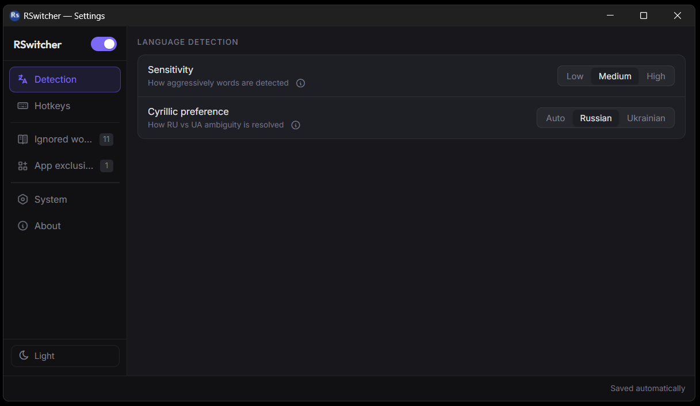
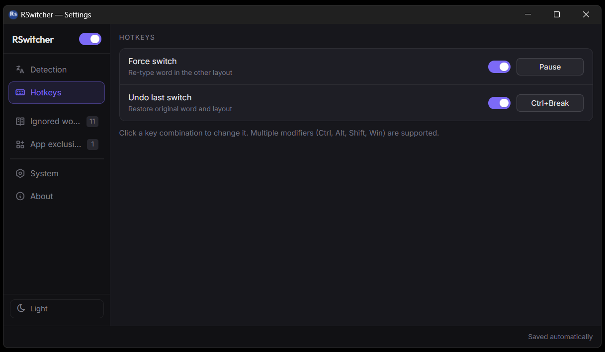
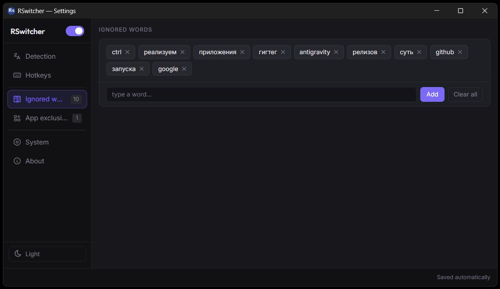
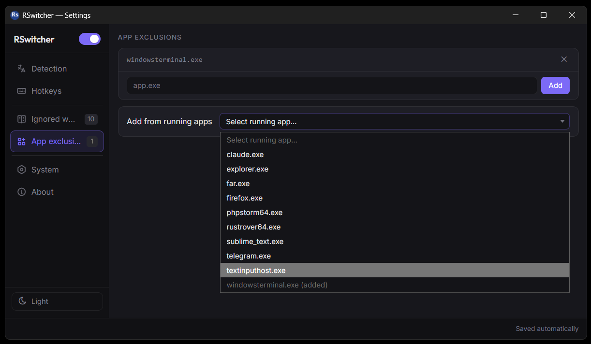
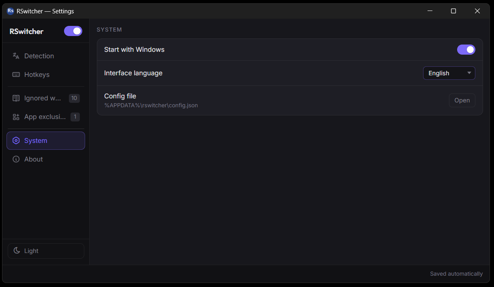

# RSwitcher

**Stop retyping. Let your keyboard adapt.**

A lightning-fast, automatic keyboard-layout switcher for Windows. 
Typed `ghbdtn` instead of `привет`? RSwitcher fixes it right where you type — EN ↔ RU ↔ UA.

[Website](https://rswitcher.reslab.pro) · [Download](https://github.com/andrewchuev/rswitcher/releases/latest) · [Contact & feedback](https://rswitcher.reslab.pro/#contact)

 

---

## What it does

You are typing, and halfway through the sentence you notice the wrong layout is active. RSwitcher notices too — and converts the word on the spot, switches the layout, and lets you keep going. No popups, no extra keystrokes.

| You type | You get |
|---|---|
| `ghbdtn, rfr ltkf/` | `привет, как дела?` |
| `руддщ цщкдв` | `hello world` |
| `scyedfyyz` | `існування` |

## Highlights

- **Fixes it as you type.** Switching happens mid-word as soon as the mistake is clear, or at the end of the word — you never have to stop and think about layouts.
- **Three languages, one tool.** English, Russian and Ukrainian, including telling Russian from Ukrainian by their typical letters.
- **Knows when to stay out of the way.** Code, identifiers, URLs, file names and technical terms are left alone, so `camelCase` and `snake_case` stay intact.
- **Learns from you.** Force-switch a word once and it is remembered. Undo a wrong switch and that word is never touched again.
- **Hotkeys your way.** Force a switch or undo one with any key combination — or just double-tap `Shift` or `Ctrl`.
- **100% private.** Everything runs locally on your machine. No cloud, no telemetry, no account.
- **Light and quiet.** Lives in the system tray, shows the current layout with a flag, and uses under 15 MB of RAM.
- **Per-app control.** Turn auto-switching off for terminals, IDEs, games or any other program.

## Make it yours

Detection sensitivity, hotkeys, ignored words and per-app exclusions — all in a clean settings window with dark and light themes, available in English, Russian and Ukrainian. Changes are saved automatically.

<table>
  <tr>
    <td align="center" width="50%">
       
      <b>Hotkeys</b> 
      Re-type a word or undo a switch with a single key.
    </td>
    <td align="center" width="50%">
       
      <b>Ignored words</b> 
      Terms and slang that should never be switched — added by you or learned automatically.
    </td>
  </tr>
  <tr>
    <td align="center" width="50%">
       
      <b>App exclusions</b> 
      Pick any running program and exclude it in one click.
    </td>
    <td align="center" width="50%">
       
      <b>System</b> 
      Start with Windows, choose the interface language.
    </td>
  </tr>
</table>

## Get started

1. Download the latest release from the [Releases page](https://github.com/andrewchuev/rswitcher/releases/latest):
   - **Installer** (`.exe`) — the recommended way;
   - **Portable** (`rswitcher-portable.zip`) — unzip and run, nothing to install.
2. Make sure the keyboard layouts you use (English, Russian and/or Ukrainian) are added in Windows.
3. Run RSwitcher. It hides in the system tray and starts working immediately.

**Requirements:** Windows 10 or 11, 64-bit.

## Everyday use

| | |
|---|---|
| Double-click the tray icon | Open settings |
| Right-click the tray icon | Settings · Auto-switch on/off · Exit |
| `Ctrl` + `Shift` + `Backspace` | Force-switch the current word *(default, customizable)* |
| `Ctrl` + `Shift` + `Alt` + `Backspace` | Undo the last switch *(default, customizable)* |

Hotkeys are switched on in **Settings → Hotkeys**, where you can also record your own: any combination of `Ctrl`, `Alt`, `Shift`, `Win` and a key, or a quick double tap of `Shift` / `Ctrl`.

## Feedback

Found a bug, have a question or an idea how to make RSwitcher better? Use the [contact form](https://rswitcher.reslab.pro/#contact) on the website or write to **contact@reslab.pro**. When reporting a problem, it helps to attach the latest log file from `%APPDATA%\rswitcher\logs`.

## License

MIT. Made by [ResLab](https://reslab.pro).
